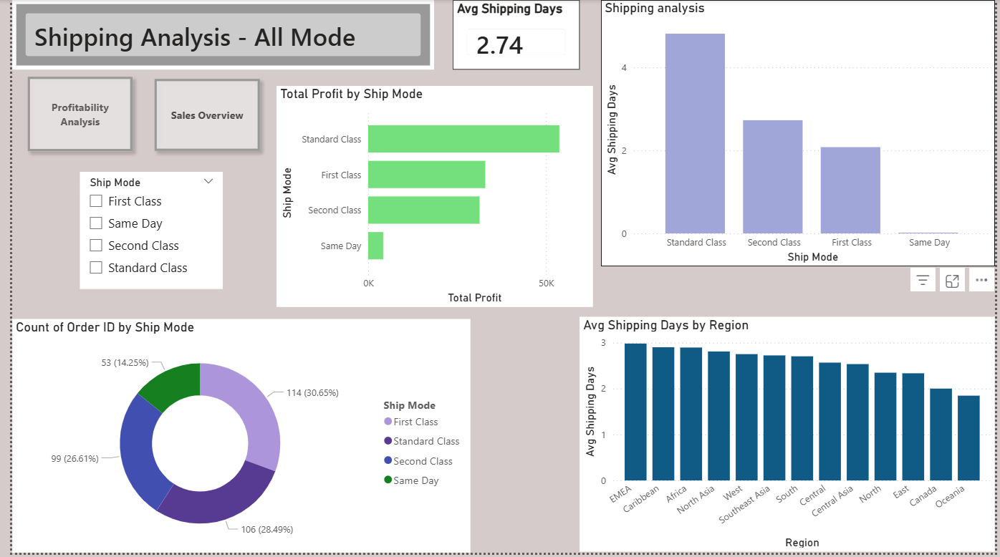

# 📊 Global Superstore Sales Analysis Dashboard

## 📌 Project Overview

This project presents an interactive Power BI dashboard built using the Global Superstore dataset. The objective of the project is to analyze sales performance, profitability, customer behavior, and shipping efficiency to generate actionable business insights.

The dashboard is divided into three analytical sections:

- Sales Overview
- Profitability Analysis
- Shipping Analysis

---

## 🛠 Tools & Technologies Used

- Power BI
- DAX (Data Analysis Expressions)
- Data Modeling
- Power Query
- SQL (Exploratory Data Analysis)
- Data Visualization

---

## 📂 Dashboard Pages

### 1️⃣ Sales Overview Dashboard

This page provides a high-level view of business performance.

**KPIs:**
- Total Sales
- Total Profit
- Total Orders

**Visualizations:**
- Sales Trend Analysis
- Category-wise Sales Distribution
- Top Customers Analysis
- Sales by Country
- Sales by Market

---

### 2️⃣ Profitability Analysis Dashboard

This page focuses on understanding profit performance and identifying loss-making areas.

**Visualizations:**
- Total Profit by Category
- Profit Margin by Region
- Profit Margin by Sub-Category
- Top Loss-Making Products
- Discount vs Profit Analysis
- Monthly Profit Trend

**Key Finding:**
- Envelopes was identified as the least profitable sub-category with a negative profit margin.

---

### 3️⃣ Shipping Analysis Dashboard

This page evaluates shipping performance and operational efficiency.

**Visualizations:**
- Average Shipping Days
- Average Shipping Days by Region
- Average Shipping Days by Ship Mode
- Shipping Mode Usage Distribution

---

## 📈 Key Business Insights

### Sales Insights
- APAC generated the highest sales among all markets.
- A small group of customers contributed significantly to total sales.
- Technology was one of the strongest-performing categories.

### Profitability Insights
- Most sub-categories were profitable.
- Envelopes was the only sub-category with a negative profit margin.
- Certain products generated losses despite contributing to revenue.
- Higher discounts were associated with reduced profitability in some cases.

### Shipping Insights
- Standard Class was the most frequently used shipping mode.
- Shipping performance varied across regions.
- Delivery efficiency differed by shipping method.

---

## 🧠 Skills Demonstrated

- Data Cleaning
- Data Transformation
- Data Modeling
- DAX Measures
- KPI Development
- Business Analysis
- Dashboard Design
- Data Storytelling
- Power BI Visualization

---

## 📸 Dashboard Screenshots

### Sales Overview

### Profitability Analysis

### Shipping Analysis

## 📁 Project Files

- Global_Superstore_Dashboard.pbix
- Global_Superstore.csv
- Global_Superstore_SQL_Analysis.sql
- Dashboard Screenshots
- README.md

---

## 🎯 Project Objective

The goal of this project was to transform raw business data into meaningful insights through interactive dashboards, enabling better decision-making in areas such as sales growth, profitability improvement, and shipping performance.

---

## 👤 Author

**Your Name**

- LinkedIn: https://www.linkedin.com/in/honey-tandel-78669828b?utm_source=share_via&utm_content=profile&utm_medium=member_ios
- GitHub: [Add Your GitHub Profile Link]
